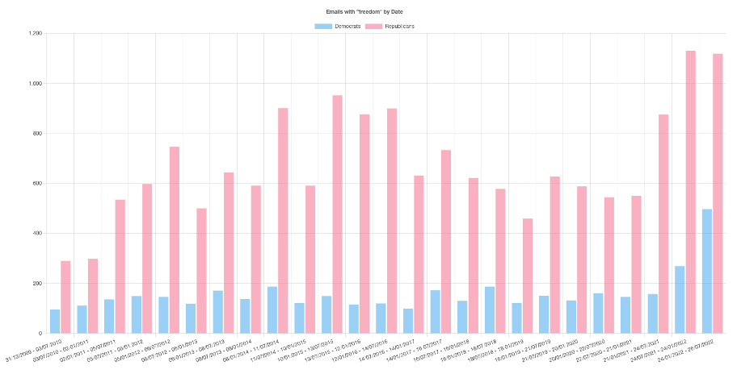
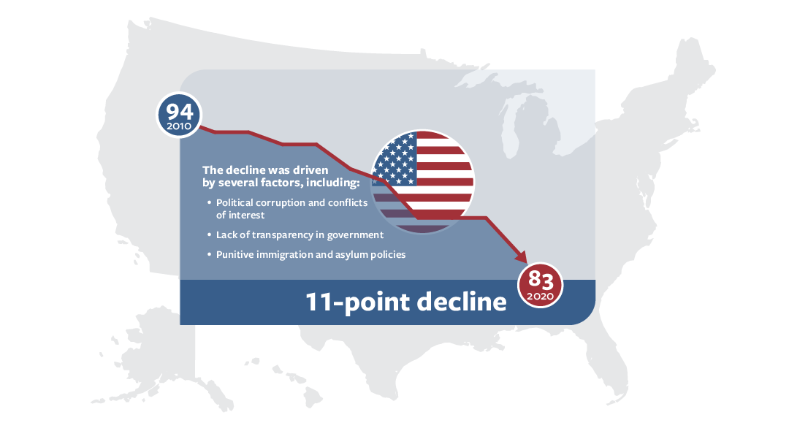
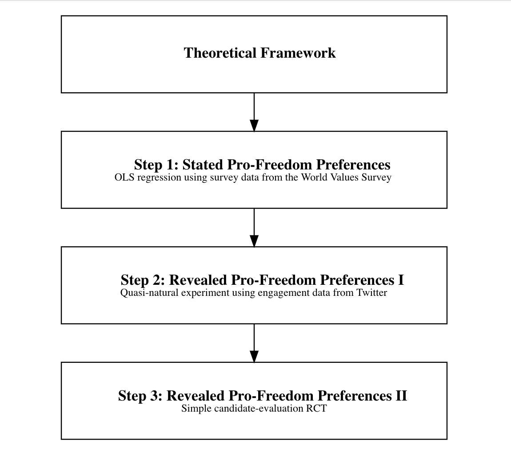
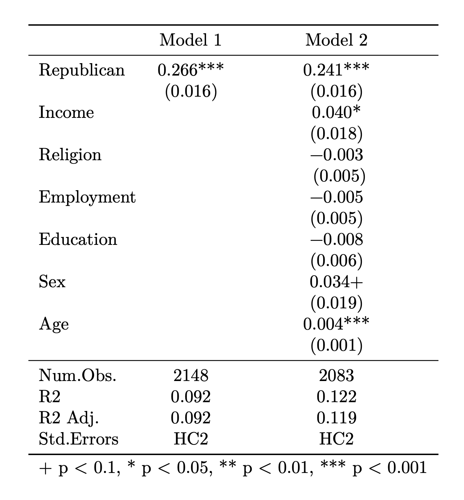
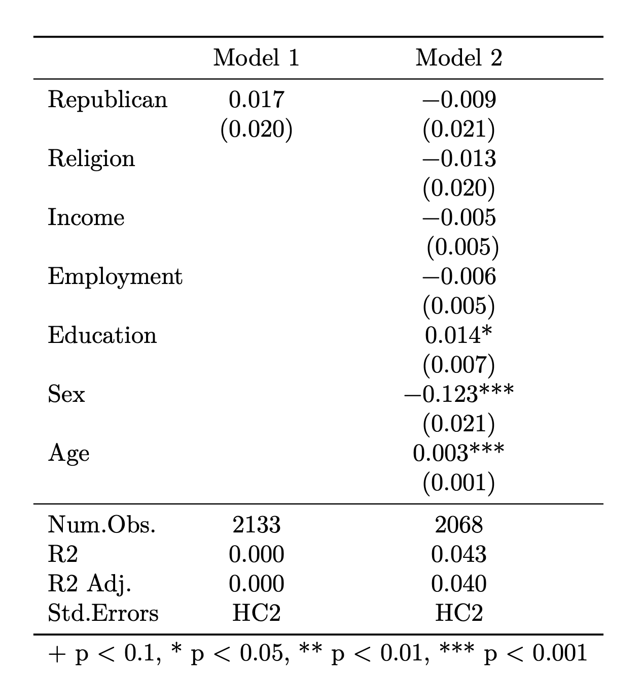

\onehalfspacing

\vspace{300pt}

\begin{center}
{\footnotesize The following writing sample is an amended and abbreviated version of my master's thesis, Free Reign: The Rhetorical Capture of Pro-Freedom Values by Authoritarian Populists in America. This work was originally submitted on the 29th of July 2022 in partial fulfillment of the requirements for the Master of Arts Program in the Social Sciences at the University of Chicago.

Full replication materials are available at https://github.com/j-nikolovski/writing-sample. Enjoy!}
\end{center}


\newpage

```{r setup, echo=FALSE, warning = FALSE, message = FALSE}
# Code chunk settings
knitr::opts_chunk$set(echo=FALSE, warning=FALSE, message=FALSE, results='asis')

#Setup and standard packages

library(tidyverse)
library(estimatr)
library(knitr)
library(modelsummary)
library(DiagrammeR)
```


# Introduction

Freedom is etched into America’s founding creed. An inalienable right; a promise proffered to all. A virtue underpinned by the presence of elected, representative governance. A virtue underpinned by democracy. For much of American history, freedom was firmly the cause of small-d democrats – revolutionaries, abolitionists, civil rights activists, and suffragettes (Rieder 2014). From the Liberty Line to the Freedom Rides, the notions of freedom and democracy were inextricably linked. In modern America’s embattled democracy, is that tapestry fraying at the seams?

A brief survey of the American political landscape begins to tell that tale. In their landmark work on the Tea Party Movement, Skocpol and Williamson (2016) credit the movement’s success – at least in part – to the work of libertarian advocacy group FreedomWorks. Their simple message of economic conservatism called for “lower taxes, less government, more freedom” (Skocpol and Williamson 2016, p.9). That success saw the Tea Party Movement convert its grassroots efforts into votes, and its members caucus together in the US House of Representatives as the House Freedom Caucus. Many of its members went on to occupy highly influential posts in the Trump Administration, including Mark Meadows and Mick Mulvaney, who each served as Trump’s Chief of Staff. Trump’s current for-profit, election-denying speaking circuit is simply named the \textit{American Freedom Tour} (Fowler, Dawsey and Arnsdorf 2022).

Once on the party’s fringes, a rightward shift has brought the Tea Party Movement to the Republican mainstream. A distinctly pro-freedom rhetoric has been brought with it. Lindsey Cormack’s (2022) database, DCinbox, stores every official e-newsletter distributed by each member of Congress since 2009. Performing a simple string-search for the terms ‘freedom’ and ‘liberty’ returns the following results. These results show that, over the past 12.5 years, Republicans have been 4.4 times more likely to invoke freedom and/or liberty in their messaging. 

```{r, out.width = '90%', fig.align='center'}

```

\begin{center}

{\small \textbf{Figure 1}: Number of Congressional e-newsletters containing the term ‘freedom’ by party (Cormack 2022)}

\end{center}

\newpage

|                  | Republican Party | Democratic Party |
|------------------|------------------|------------------|
| 'Freedom'        | 16,882           | 3,981            |
| 'Liberty'        | 7,099            | 1,460            |
| Total            | 23,981           | 5,441            |

\begin{center}

{\small \textbf{Table 1}: Number of Congressional e-newsletters containing the terms ‘freedom’ and/or ‘liberty’ by party (Cormack 2022)}

\end{center}

Members of the GOP are not only featuring freedom in their Congressional communications, but in their campaign messaging too. One need look no further than the website of the Republican National Committee (2022a) whose homepage leads with the phrase “Freedom Matters”. Delving deeper, the preamble to the party’s current platform simply states “ours is the party of liberty” (RNC 2022b). Is it the party of democracy too?

To answer this controversial question, I lean on the work of the Global Party Survey (GPS) (Norris 2020b). The GPS surveys 1,861 experts across 163 countries, asking respondents to score political parties by their disrespect for liberal democratic principles, norms, and practices (authoritarianism), and by their use of populist rhetoric (populism). Each is measured on a scale from 0 to 10. While there is no foolproof way of classifying a party as being authoritarian or populist, the GPS deems any party with an aggregate score of 6 or greater in each measure to be an authoritarian populist party. Expert appraisal of the GOP squarely categorizes it as such. Perhaps freedom and democracy have begun to chart a divergent course?

To many scholars of political science, that suggestion might border on the absurd. In the comparative politics literature, the concepts of freedom and democracy are inextricably linked. Using survey, social media, and experimental evidence, my research strives to test that assertion. In modern American politics, do pro-freedom values beget pro-democratic attitudes?


# The Democratizing Rise of Pro-Freedom Values

Borrowing from comparative politics, the conventional wisdom linking freedom and democracy is best explicated by Christian Welzel’s (2013) Freedom Rising. In his book, Welzel attempts to account for the “rapid expansion of universal freedoms and democracy” that had occurred throughout the latter half of the twentieth century. Building upon Ronald Inglehart’s (1977) famed work on postmaterialism and their joint work on self-expression values (Inglehart and Welzel 2005), Welzel finds that one of the key causal factors accounting for this trend is a rise in what he terms ‘emancipative values’ – a belief in the “freedom of choice and the equality of opportunity” (Welzel 2013, p.xxv).

Using data from the World Values Survey, Welzel (2013, p.59) derives an index of emancipative values designed to measure “how strongly people claim authority over their lives for themselves”. To do so, Welzel combines twelve variables into four factors: autonomy, equality, choice, and voice. Measured across time and place, Welzel charts an almost ubiquitous, six-decade rise in this measure – a trend led by America and the West. To Welzel, this yearning for freedom drove a widespread thirst for political empowerment that only democracy could quench.

Welzel is not alone in linking the concepts of freedom and democracy. Russell Dalton’s (2014) book Citizen Politics similarly argues that individuals have become “more interested in protecting individual freedoms”, and his work with To-ch’ol Sin and Willy Jou echoes the seemingly inexorable link between freedom and democracy (Dalton, Sin and Jou 2007). They find that survey respondents worldwide primarily define democracy by the presence of freedom and liberty – the provision of which they consider to be the “essential goal” of democracy (Dalton, Sin and Jou 2007, p.144). On the individual level, they conclude that “people want freedom, liberty and control over their lives – and that they see democracy as the means of achieving these goals” (Dalton, Sin and Jou 2007, p.153).

At this juncture, you might ask whether Welzel’s stance has softened in the decade since? Writing in 2013, Freedom Rising predates the events of Trump and Brexit (among others) that burst the literature on democratic erosion in the West into life. On the contrary, Welzel’s belief in the democratizing force of emancipative values remains resolute. Welzel (2021a, p.132) acknowledges the “momentary challenges” with which democracy is presently faced, but argues that the “tectonic cultural transformation” that his emancipative values index represents still bends the arc of politics toward democracy. In his own words, he concludes that the “almost ubiquitous ascension of emancipative values will lend more, not less, legitimacy to democracy in the future” (Welzel 2021b, p.992).

Furthermore, the union of these two terms is subject to an almost-unanimous consensus in the backsliding literature. Freedom House (2022), for example, publishes a widely cited measure of freedom that is a direct function of the health of a nation’s democracy. Adam Przeworski (2016, p.8) too, while casting philosophical doubt upon the true extent of freedom in modern democracies, acknowledges “that democracy is the only system that allows people to live in freedom”. Welzel (2021b, p.1012) concurs: “in its essence, democracy is about freedoms”.


# The Autocratizing Rise of Authoritarian Populism

If emancipative values – headlined by a yearning for freedom – are a growing and democratizing force, then we should expect the processes of democratization to be ongoing (Welzel 2021a). Most scholars of American politics now argue that the opposite is true.

```{r, out.width = '75%', fig.align='center'}

```

\begin{center}

{\small \textbf{Figure 2}: United States aggregate \textit{Freedom in the World} scores 2010-2020  (Freedom House 2021)}

\end{center}

This process of democratic erosion is not novel to history, but its modern form has taken on a different shape. Less frequently are democracies subverted by bloodshed and brazen fraud, but by a slower and more ambiguous form of “democratic backsliding” (Bermeo 2016). To Nancy Bermeo (2016), coups d’état are now frequently veiled with the empty promise of democratic restoration; outright election fraud is replaced by the subtle and strategic manipulation of elections; and executive power is vexingly aggrandized to lock out opposition and subvert the rule of law.

In their analysis of America, Levitsky and Ziblatt (2018) focus on the latter two, noting that the forces of democratic erosion increasingly come from within the electoral process itself. They identify an array of elected officials – Donald Trump in chief – who are exhibiting what they call “authoritarian behaviors” (Levitsky and Ziblatt 2018, p.26). Leaders who exhibit these tendencies typically reject the “democratic rules of the game”, undermine the political legitimacy of their rivals, tolerate (or even encourage) violence, and willingly restrict the freedoms of those who oppose them (Levitsky and Ziblatt 2018, p.26-7).

Like Trump, these leaders obfuscate these tendencies behind a distinctly populist message (Oliver and Rahn 2016). Per Pippa Norris (2017, p.15), this blend of authoritarianism and populism has been a key driver of democratic backsliding in the United States, with populist rhetoric serving to “undercut the legitimacy of the checks and balances of liberal democracy”. Thereby paving the way for those with authoritarian tendencies to slowly work on breaking down these democratic norms. Norris (2016; 2019) not only finds that an increasing number of parties and leaders are exhibiting these behaviors in America, but that their political salience is growing too (Lewis et al. 2018). 


# Theoretical Framework

How can we reconcile these seemingly oxymoronic trends? How can authoritarian populism rise in tandem with emancipative values? To guide this research, I pose a simple explanation: While pro-freedom values are exceedingly common, they are not unanimously so. Perhaps it is merely the case that authoritarian populist voters are just not particularly pro-freedom at all?

The comparative literature on authoritarianism works unanimously in advance of this simple hypothesis. Just as freedom and democracy are deemed inherently linked, freedom and authoritarianism are deemed inherently juxtaposed. Not just normatively, but behaviorally too. To Welzel (2021a, p.132) himself, democratic values prioritize freedom and choice, while authoritarian values “stress deference and conformity”. Norris and Inglehart (2019, p.8) concur, arguing that authoritarian populists favor order and security, while democrats strive to protect civil liberties. Karen Stenner (2005) argues that this incompatibility is due to freedom and autonomy producing difference, which authoritarian personalities oppose. Accordingly, Stenner (2005, p.142) concludes that what authoritarians stand for “can never include individual freedom”. Authoritarianism is not alone in its purported incompatibility with freedom either. According to Benjamin Moffitt (2017, p.112), populism too is considered to be an “illiberal phenomenon”, and if it is required in any clearer terms, Bob Altmeyer’s (1988) book on right-wing authoritarianism is simply titled Enemies of Freedom.

Nevertheless, freedom – particularly in America – is a ubiquitous concept and a common phrase. It is difficult to imagine any individual respondent – even those with the most textbook authoritarian personality – speaking ill of freedom or consciously choosing to reject it. For that reason, I pose a hypothesis with a relatively low burden of proof. Rather than seeking to prove that authoritarian populists are anti-freedom, I hypothesize that they simply exhibit weaker pro-freedom preferences than their more democratically-minded counterparts:

\begin{center}

\textbf{H: \textit{Authoritarian populist voters exhibit weaker pro-freedom values than democrats}}

\end{center}

Accordingly, this is the hypothesis that guides the structure of this research, and it will be tested in three main parts. Firstly, I will use data from the World Values Survey to test Americans’ stated pro-freedom preferences. Secondly, I will conduct a quasi-natural experiment using social media engagement data from Twitter to test Americans’ revealed preferences. Thirdly and finally, with questions of causality still abound, I will pilot a simple candidate-evaluation RCT to measure the same. The methodology and results of which will be discussed in turn.

```{r, results='hide'}
# Create theoretical framework flowchart
grViz("digraph flowchart {
  node [shape = box, width=5, height=1]
  a [label = <<B>Theoretical Framework</B>>]
  b [label = <<B>Step 1: Stated Pro-Freedom Preferences</B><BR/><FONT POINT-SIZE='10'>OLS regression using survey data from the World Values Survey</FONT>>]
  c [label = <<B>Step 2: Revealed Pro-Freedom Preferences I</B><BR/><FONT POINT-SIZE='10'>Quasi-natural experiment using engagement data from Twitter</FONT>>]
  d [label = <<B>Step 3: Revealed Pro-Freedom Preferences II</B><BR/><FONT POINT-SIZE='10'>Simple candidate-evaluation RCT</FONT>>]

  a -> b -> c -> d
}
")
```

```{r, out.width = '70%', fig.align='center'}

```

\begin{center}

{\small \textbf{Figure 3}: Theoretical framework flowchart}

\end{center}

Before turning to this analysis, it is worth briefly outlining some of the overriding principles that guide this research. Firstly, I am choosing to define pro-freedom and pro-democratic values in the most narrow and functional sense possible. Individuals are taken to be pro-freedom if they say they are pro-freedom, however it might be internally defined. I save normativity and semantics to philosophers and theorists. Similarly, individuals are taken to be pro-democratic if they vote for, or otherwise support, a party who upholds the tenets of liberal democracy as measured in the Global Party Survey (Norris 2020a), and vice versa for authoritarian populists.


# Stated Pro-Freedom Preferences: Evidence from the World Values Survey

Pursuant to the aforementioned ubiquity of freedom, survey data explicitly asking respondents to appraise the standalone value of freedom is scant. Wave 7 of the World Values Survey (WVS), however, does ask respondents to select whether they deem freedom to be more important than equality and security (Haerpfer et al. 2022). With the WVS survey serving as the foundation of Welzel’s (2013) analysis, it seems a fitting place to start.

The seventh wave of the WVS polls 2,596 Americans on a broad array of political attitudes. My sample consists of the 2,148 respondents who both: a) adjudicated between freedom and equality/security; and b) expressed a clear party preference. 816 (37.99%) of these respondents signaled their support for the GOP, and each are marked by a dummy variable denoting their authoritarian populist support.

```{r}
# Load data from the World Values Survey 7 (Download available at: https://drive.google.com/drive/folders/1AUkaU_m1WyBQmkeiV-c8RLwZ7GveYA_M?usp=sharing)
load("wvs7.RData")

# Rename data set
wvs7 <- `WVS_Cross-National_Wave_7_rData_v4_0`
```

```{r, results = 'hide'}
# Subset data to American respondents with political party data
wvs7_usa <- wvs7 %>%
  mutate(american = case_when(B_COUNTRY_ALPHA == "USA" ~ 1,
                                     TRUE ~ 0))

wvs7_usa <- wvs7_usa %>%
  subset(american == 1)

# Subset data to respondents who listed a clear party preference
wvs7_usa <- wvs7_usa %>%
  mutate(clear_party_preference = case_when(Q223 > 9 ~ 1,
                                            TRUE ~ 0))

wvs7_usa <- wvs7_usa %>%
  subset(clear_party_preference == 1)

# Create Republican voter variable
wvs7_usa <- wvs7_usa %>%
  mutate(republican = case_when(Q223 == 840001 ~ 1,   # Republican Party (GOP)
                                        TRUE ~ 0))

# Recode Q149 freedom variable
wvs7_usa <- wvs7_usa %>%
  mutate(freedom_or_equality = case_when(Q149 == 1 ~ 1,
                                         Q149 == 2 ~ 0))

# Recode Q150 freedom variable
wvs7_usa <- wvs7_usa %>%
  mutate(freedom_or_security = case_when(Q150 == 1 ~ 1,
                                         Q150 == 2 ~ 0))

# Identify number of Republican supporters in the sample
wvs7_usa %>%
  group_by(republican) %>%
  count()
```

Norris and Inglehart (2019, p.15) find that authoritarian populist voters are typically older, less educated, poorer, more religious, and male. Accordingly, I use these covariates to test the balance of our authoritarian populist dummy variable as follows. Expectedly, our sample exhibits the very same imbalances. Duly proportional to the population, I rely here on a simple OLS regression model for my analysis, with no need for matching, weighting, or stratification.

```{r, results = 'hide'}
# Balance check
wvs7_usa %>%
  group_by(republican) %>%
  filter(!is.na(republican)) %>%
    summarize("Age" = mean(Q262),
              "Sex" = mean(Q260),
              "Education" = mean(na.omit(Q275)),
              "Income" = mean(na.omit(Q288R)),
              "Religion" = mean(na.omit(Q289)), 
              "Employment Status" = mean(na.omit(Q279)))
```

| Republican?                   | Age  | Sex  | Education | Income | Religion | Employment |
|-------------------------------|------|------|-----------|--------|----------|------------|
| No                            | 41.8 | 1.49 | 5.08      | 1.88   | 1.13     | 2.58       |
| Yes                           | 47.4 | 1.38 | 4.81      | 1.94   | 1.51     | 2.59       |

\begin{center}

{\small \textbf{Table 2}: Covariate balance table}\\[1pt]
{\footnotesize (World Value Survey measures of sex, education, income, employment status and religion can be found in the World Values Survey Codebook (WVS 2022))}

\end{center}

Beginning with the question of freedom versus equality, a dummy variable is constructed to represent whether respondents selected freedom as the more important value of the two. Those who did so are assigned a value of 1, those who preferred equality are assigned a value of 0. Returning to our hypothesis, we would expect authoritarian populist voters to be less pro-freedom than their more democratically minded compatriots. Using linear regression to take a simple difference-in-means tells a vastly different story.

```{r, results = 'hide', tidy = FALSE}
# Freedom vs Equality Linear Regressions

# Simple linear regression
lm_robust(freedom_or_equality ~ republican,
          data = wvs7_usa)

# With controls
lm_robust(freedom_or_equality ~ republican + Q288R + Q289 + Q279 + Q275 + Q260 + Q262,
          data = wvs7_usa)

# Chi-squared test
chisq.test(wvs7_usa$freedom_or_equality, wvs7_usa$republican, correct = FALSE)
```

```{r, tidy = FALSE, fig.pos='H', results='hide'}
# Coefficient table
mod_1 <- lm_robust(freedom_or_equality ~ republican,
          data = wvs7_usa)

mod_2 <- lm_robust(freedom_or_equality ~ republican + Q288R + Q289 + Q279 + Q275 + Q260 + Q262,
                   data = wvs7_usa)

mods <- list(mod_1, mod_2)

# To rename covariates
rename_vector <- c("republican" = "Republican",
                   "Q288R" = "Income",
                   "Q289" = "Religion",
                   "Q279" = "Employment",
                   "Q275" = "Education",
                   "Q260" = "Sex",
                   "Q262" = "Age")

modelsummary(mods, coef_map = rename_vector, stars = TRUE)
```

```{r, out.width = '50%', fig.align='center'}

```

\begin{center}

{\small \textbf{Table 3}: OLS Regression Results: Freedom Over Equality}\\[1pt]
{\footnotesize Note:* p<0.1;** p<0.05;*** p<0.01}\\[1pt]
{\footnotesize Pearson’s Chi-Squared Test: $X^2 = 198.2$}

\end{center}

These results tell a clear and consistent story – Republican voters in the sample are significantly more likely to prioritize freedom over equality. An increase of 26.6 percentage points. In other words, 66.3% of Democrats rank freedom above equality. That number increases to 92.9% among Republicans. This result is robust to demographic controls, and both point estimates for the effect are statistically significant at the α = 0.01 level. Using a binary dependent variable, we can also assess the difference in means probabilistically via logistic regression. Statistically significant at the α = 0.01 level, logit models with and without controls return odds ratios of 6.64 and 6.02, underscoring the magnitude of the effect that being an authoritarian populist has on selecting freedom over equality. When comparing freedom and equality, authoritarian populist voters are decidedly more pro-freedom than their democratic counterparts.

```{r, results = 'hide'}
# Simple logit model
logitmodel <- glm(freedom_or_equality ~ republican,
                  data = wvs7_usa,
                  family = "binomial")

summary(logitmodel)
```

```{r, results = 'hide'}
# Calculate odds ratios
logitmodel %>%
  coef() %>%
  exp()
```

```{r, results = 'hide'}
# Logit model with controls
logitmodel2 <- glm(freedom_or_equality ~ republican + Q288R + Q289 + Q279 + Q275 + Q260 + Q262,
                  data = wvs7_usa,
                  family = "binomial")

summary(logitmodel2)
```

```{r, results = 'hide'}
# Calculate odds ratios
logitmodel2 %>%
  coef() %>%
  exp()
```

While compelling, these results alone are insufficient to reject the hypothesis. Equality is hardly an authoritarian value (Altmeyer 1988; Welzel 2021a), and surveyed respondents were given no choice but to select between the two. Perhaps freedom is simply more desirable to authoritarian populist voters than equality – not desirable in and of itself. Fortunately, the survey’s following question pits freedom against a typically authoritarian value – security. As Karen Stenner (2005) argues in The Authoritarian Dynamic, a hallmark of the authoritarian personality is the sacrifice of freedom for security. When faced with that very question in the WVS, my hypothesis would expect respondents to do just that. 

```{r, results = 'hide', tidy = FALSE}
# Freedom vs Security Linear Regressions

# Simple linear regression
lm_robust(freedom_or_security ~ republican,
          data = wvs7_usa)

# With controls
lm_robust(freedom_or_security ~ republican + Q288R + Q289 + Q279 + Q275 + Q260 + Q262,
          data = wvs7_usa)

# Chi-squared test
chisq.test(wvs7_usa$freedom_or_security, wvs7_usa$republican, correct = FALSE)
```

```{r, tidy = FALSE, fig.pos='H', results='hide'}
# Coefficient table
mod_a <- lm_robust(freedom_or_security ~ republican,
          data = wvs7_usa)

mod_b <- lm_robust(freedom_or_security ~ republican + Q288R + Q289 + Q279 + Q275 + Q260 + Q262,
                   data = wvs7_usa)

mods <- list(mod_a, mod_b)

# To rename covariates
rename_vector <- c("republican" = "Republican",
                   "Q288R" = "Religion",
                   "Q289" = "Income",
                   "Q279" = "Employment",
                   "Q275" = "Education",
                   "Q260" = "Sex",
                   "Q262" = "Age")

modelsummary(mods, coef_map = rename_vector, stars = TRUE)
```

```{r, out.width = '50%', fig.align='center'}

```

\begin{center}

{\small \textbf{Table 4}: OLS Regression Results: Freedom Over Security}\\[1pt]
{\footnotesize Note:* p<0.1;** p<0.05;*** p<0.01}\\[1pt]
{\footnotesize Pearson’s Chi-Squared Test: $X^2 = 0.7$}

\end{center}

On the contrary, I find that a substantial majority of Republican voters (72.7%) in the sample still prioritize freedom over security. Furthermore, I find authoritarian populist party support to have no significant effect on this value judgement. Logistic regression models confirm the same, returning odds ratios of 1.09 and 0.96 respectively. This evidence speaks directly against the hypothesis motivating this study. When it comes to comparing freedom and security, authoritarian populists are just as likely to prioritize the former as their democratic counterparts.

```{r, results = 'hide'}
# Simple logit model
logitmodel3 <- glm(freedom_or_security ~ republican,
                  data = wvs7_usa,
                  family = "binomial")

summary(logitmodel)
```

```{r, results = 'hide'}
# Calculate odds ratios
logitmodel3 %>%
  coef() %>%
  exp()
```

```{r, results = 'hide'}
# Logit model with controls
logitmodel4 <- glm(freedom_or_security ~ republican + Q288R + Q289 + Q279 + Q275 + Q260 + Q262,
                  data = wvs7_usa,
                  family = "binomial")

summary(logitmodel4)
```

```{r, results = 'hide'}
# Calculate odds ratios
logitmodel4 %>%
  coef() %>%
  exp()
```


# Revealed Pro-Freedom Preferences: Evidence from Twitter

By stated preference, the above evidence clearly speaks against our hypothesis. Is this outsized pro-freedom sentiment consistent in the behaviors of authoritarian populist voters too? Conducting such an inquest is an unenviable task. How can we empirically observe pro- freedom behavior? The answer I offer in this research is found in the use of social media engagement data from Twitter. Here I ask the following: does a politician invoking the value of freedom online drive more engagement? More specifically, is this effect larger for more democratically-minded politicians than it is for authoritarian populists? Our hypothesis would suggest so.

To further test this theory, this section utilizes a dataset compiled by Laura Wrubel and Daniel Kerchner (2020). It contains 692,936 ‘Tweet IDs’ from the 102 senators that served in the 116th United States Congress. Tweet data was extracted from these IDs via Documenting the Now’s (2020) Hydrator software. Each observation represents an individual tweet by one of the 102 senators from between 2008 and May 2020. For the purposes of this research, tweets from each senator’s ‘Press’ and/or ‘Office’ accounts have been removed. These tweets typically generate little engagement, are explicitly representative of the senator’s office and staff, and are typically reserved for fairly mundane official-business. All tweet data from ‘retweeted’ tweets have likewise been removed. Each of these steps were taken to ensure that the tweets in question are representations of the individual senators themselves. After cleaning, the dataset comprises of 561,763 unique observations. 

```{r, warning = FALSE}
# Load data set
senate116 <- read_csv("congress116-senate-ids.csv")
```

```{r}
# Subset data to only include relevant variables
senate116_tidy <- subset(senate116, select = c(id,
                                               created_at,
                                               user_id,
                                               user_name,
                                               user_screen_name,
                                               user_followers_count,
                                               text,
                                               retweet_count,
                                               favorite_count,
                                               retweet_id))

# Filter out tweets from 'Office' and/or 'Press' accounts
senate116_tidy <- senate116_tidy %>%
  filter(!str_detect(user_name, "Press|Office"))

# Filter out retweeted tweets
senate116_tidy <- senate116_tidy %>% 
  filter(is.na(retweet_id))

# Drop retweet_id variable (no longer necessary)
senate116_tidy <- subset(senate116_tidy, select = -c(retweet_id))

# Rename variables
senate116_tidy <- senate116_tidy %>%
  rename(retweets = retweet_count)

senate116_tidy <- senate116_tidy %>%
  rename(favorites = favorite_count)

senate116_tidy <- senate116_tidy %>%
  rename(followers = user_followers_count)

#Create party dummy variable
senate116_tidy <- senate116_tidy %>%
  mutate(leg_republican = as.integer(str_detect(senate116_tidy$user_name,"Shelby|Sullivan|Murkowski|McSally|Cotton|Boozman|Gardner|Scott|Rubio|Perdue|Isakson|Loeffler|Risch|Crapo|Braun|Young|Ernst|Grassley|Roberts|Moran|McConnell|Paul|Cassidy|Kennedy|Collins|Wicker|Hyde-Smith|Hawley|Blunt|Daines|Fischer|Sasse|Tillis|Burr|Cramer|Hoeven|Portman|Inhofe|Lankford|Toomey|Graham|Rounds|Thune|Blackburn|Alexander|Cruz|Cornyn|Romney|Lee|Capito|Johnson|Barrasso|Enzi")))

#Create freedom dummy variable
senate116_tidy <- senate116_tidy %>%
  mutate(freedom = as.integer(str_detect(senate116_tidy$text,"freedom|Freedom|liberty|Liberty")))
```

Before I begin with this analysis, it is important to outline some of the key assumptions and limitations of this approach. I am broadly considering Twitter engagements as being positive responses to a tweet, and that those who engage with authoritarian populist politicians are themselves so inclined. It is a common adage amongst Twitter users that retweets should not be considered endorsements, and it is not uncommon for things to be retweeted in opposition or in jest. For the purposes of this study though, I will assume these effects are broadly consistent across all tweets, irrespective of whether they invoke the value of freedom. Finally, I will broadly refer to those engaging with these tweets as individual constituents. Of course, this is not strictly true. As a global platform, many individuals engaging with tweets might live abroad. Similarly, some engagements might come from businesses or organizational accounts. Again, I assume that these effects are roughly consistent across all tweets and variables.

With the above considerations, I proceed to my analysis. Firstly, a string search is performed across all tweets to determine whether they invoke the terms ‘freedom’ or ‘liberty’. Observations that do are assigned a dummy variable value of 1, and those that do not are assigned a value of 0. This process identifies 6,215 tweets that invoke the notion of freedom, representing just over 1.1% of the sample. 3,982 of those tweets belonged to Republican legislators (64.07%), while 2,233 belonged to Democrats (35.93%) – further preliminary evidence that it is Republicans who are more frequently invoking the notion of freedom. Similarly, a dummy variable is created to identify whether the senator is a member of the Republican Party (1) or not (0). Based on our hypothesis, we therefore expect those tweets which invoke freedom to incur a smaller change in expected favorites and retweets among Republicans. These effects are measured by way of two simple linear models: 

$$ Retweets = \beta_0 + \beta_1 Freedom + \beta_2 Republican + \beta_3 Freedom*Republican + \epsilon$$
$$ Favorites = \beta_0 + \beta_1 Freedom + \beta_2 Republican + \beta_3 Freedom*Republican + \epsilon$$

Interacting the Freedom and Republican dummy variables allows us to determine the unique effects of invoking freedom on favorites and retweets by party – and by extension, by authoritarian populist sentiment. The results of these two models are visualized in the figures below: 

```{r, results = 'hide'}
# Retweets model
lm_robust(retweets ~ freedom*leg_republican, data=senate116_tidy)

# Favorites model
lm_robust(favorites ~ freedom*leg_republican, data=senate116_tidy)
```

| Invoked Freedom? | Party | Expected Retweets |
|------------------|-------|-------------------|
| No               | D     | 481.49            |
| Yes              | D     | 432.16            |
| No               | R     | 110.07            |
| Yes              | R     | 298.20            |

\begin{center}

{\small \textbf{Table 5}: Expected retweets by the invocation of freedom, and party}

\end{center}

\newpage

| Invoked Freedom? | Party | Expected Favorites |
|------------------|-------|--------------------|
| No               | D     | 1,820.68           |
| Yes              | D     | 1,376.42           |
| No               | R     | 375.86             |
| Yes              | R     | 715.15             |

\begin{center}

{\small \textbf{Table 6}: Expected favorites by the invocation of freedom, and party}

\end{center}

\vspace{30pt}

```{r, fig.align='center', fig.pos='H'}
# Retweets plot
combinations <- expand_grid(freedom = c(0,1), leg_republican = c(0,1))
mod_flex <- lm_robust(retweets ~ freedom*leg_republican, data = senate116_tidy)
combinations %>% 
  mutate(`Expected means` = predict(mod_flex, newdata = .),
         Treatment = fct_rev(ifelse(freedom == 1, "Invokes Freedom", "Null")),
         Party = ifelse(leg_republican == 1, "Republican", "Democrat")) %>%
  pivot_longer(cols = c(`Expected means`)) %>% 
  ggplot(aes(x = Treatment, y = value, col = Party)) + 
  geom_point() +
  geom_line(aes(group = leg_republican)) +
  facet_wrap(vars(name)) + 
  scale_color_manual(values = c("blue", "red")) + 
  labs(y = "Retweets")
```

\begin{center}

{\small \textbf{Figure 4}: Expected retweets by the invocation of freedom, and party}

\end{center}

```{r, fig.align='center', fig.pos='H'}
# Favorites plot
combinations <- expand_grid(freedom = c(0,1), leg_republican = c(0,1))
mod_flex <- lm_robust(favorites ~ freedom*leg_republican, data = senate116_tidy)
combinations %>% 
  mutate(`Expected means` = predict(mod_flex, newdata = .),
         Treatment = fct_rev(ifelse(freedom == 1, "Invokes Freedom", "Null")),
         Party = ifelse(leg_republican == 1, "Republican", "Democrat")) %>%
  pivot_longer(cols = c(`Expected means`)) %>% 
  ggplot(aes(x = Treatment, y = value, col = Party)) + 
  geom_point() +
  geom_line(aes(group = leg_republican)) +
  facet_wrap(vars(name)) + 
  scale_color_manual(values = c("blue", "red")) + 
  labs(y = "Favorites")
```

\begin{center}

{\small \textbf{Figure 5}: Expected favorites by the invocation of freedom, and party}

\end{center}

The results are stark. When Republican legislators invoke the value of freedom or liberty in their tweets, engagement increases considerably. The invocation of freedom almost triples the expected number of retweets (271%), and almost doubles the expected number of favorites (190%) among Republicans. The very opposite is true of Democrats. 


# Revealed Pro-Freedom Preferences: Evidence from an Online Candidate Evaluation Experiment

While this quasi-experimental approach speaks loudly against our hypothesis, it is not without its limitations. Skeptics might rightly have concerns about endogeneity, independence, and causality. For that reason, I turn to the third and final phase of my analysis, which aims to interrogate the pro-freedom attitudes of Republicans and Democrats by way of a randomized controlled trial.

Before outlining the experimental design, it must be noted that due to budget constraints this experiment has been piloted on just 100 Americans. Future iterations of this research ought to expand this sample size to produce more robust and adequately-powered point estimates for the difference-in-means estimator I will be using in this experiment.

This randomized controlled trial takes the form of a simple candidate evaluation experiment, which requires respondents to evaluate a fictitious non-partisan political candidate on a 1-10 scale. Respondents were recruited to the experiment via Amazon MTurk and directed to one of two self-designed web addresses. Upon loading the website, respondents were greeted with one of the following mock landing/homepages:


```{r, out.width = '90%', fig.align='center'}

```

\begin{center}

{\small \textbf{Figure 6}: Mock candidate homepages (treatment and control)}

\end{center}

As depicted above, the treatment variable is again the invocation of freedom. In this experiment, this takes the form of an explicitly pro-freedom campaign slogan. Respondents in our control group were directed to a mock campaign page with the slogan ‘Running for You’. Members of our treatment group were directed to a mock campaign page with the slogan ‘Running for Freedom’. The webpages are in all other respects identical.

All other design and copy choices were selected with the intention of producing the most neutral and non-partisan seeming candidate possible. The color scheme, name, and stock imagery chosen for the candidate were selected to ensure respondents would not take any partisan or racial/ethnic cues when evaluating the mock candidate. Red, blue, purple, and green, for example, were omitted due to existing party and/or politico-spatial affiliations. Likewise, the name ‘Elliott’ was chosen because – whilst still being reasonably common – there have been no candidates for federal office of the same name for over 120 years. Similarly, the chosen slogans were designed to be fairly neutral in tone. ‘Running’ was chosen over more evocative alternatives like ‘fighting’ or ‘defending’. Likewise ‘you’ was chosen as the control to ‘freedom’ to avoid pitting freedom against alternate values like security or equality (as in the World Values Survey above). The website comprised of the homepage alone, with no working/clickable links.

Candidate evaluations were procured via a Hotjar survey that automatically appeared on the screen fifteen seconds after loading the webpage. Hotjar’s survey and tracking software is more common to industry (particularly marketing, web development, and UX), but makes for a cheap, compelling, and easily-integrated choice for a simple online experiment of this kind. Future iterations of this experiment might also seek to utilize some of their additional data collection methods like click-tracking and heatmapping to determine whether respondents are more likely to try and learn more about, or even donate to, the mock candidate.

With limited information, respondents were asked to rate the candidate on a ten-point feeling thermometer, with 1 representing a strong dislike, and 10 representing a strong liking for the candidate. Candidates were also surveyed on their preferred party (Republican or Democrat), and a suite of controls used in the WVS analysis above (income, education, sex, and age). Each respondent’s location (to confirm they were completing the survey from inside America), and their treatment status were automatically recorded by Hotjar. Broken down by party, the treatment and control groups take the following forms:

```{r}
# Load data set
experiment <- read_csv("thesis_experiment_data.csv")
```

```{r}
# Tidy dataset
experiment <- experiment %>%
  mutate(freedom = ifelse(page == 'elliott4congress', 1, 0))

experiment <- experiment %>%
  mutate(republican = ifelse(party == 'Republican', 1, 0))

experiment <- experiment %>%
  filter(country == "United States of America")
```

```{r, results = 'hide'}
count(experiment, freedom==1)

count(experiment, freedom==1, republican==1)
```

```{r, results = 'hide'}
# Balance Check

# Balance check
experiment %>%
  group_by(republican) %>%
  filter(!is.na(republican)) %>%
    summarize("Age" = mean(age),
              "Sex" = mean(sex),
              "Education" = mean(education),
              "Income" = mean(income))
```

| Republican?                   | Age  | Sex  | Education | Income |
|-------------------------------|------|------|-----------|--------|
| No                            | 45.5 | 1.44 | 1.87      | 1.87   |
| Yes                           | 43.2 | 1.36 | 1.36      | 1.96   |

\begin{center}

{\small \textbf{Table 7}: Covariate balance table}

\end{center}

If, at the final stand, our hypothesis is to hold true, we should expect Republican voters in our treatment group to be less-moved by the mock candidate’s pro-freedom pledge. Emulating the quasi-Twitter experiment above, these effects are also measured by a simple linear model:

$$ Candidate Evaluation = \alpha_0 + \alpha_1 Freedom + \alpha_2 Republican + \alpha_3 Freedom*Republican + \epsilon$$

As above, interacting the freedom and Republican dummy variables allows us to determine the unique effects of invoking freedom on a respondent’s candidate evaluation by party. The result of this model is presented numerically and visually as follows:

\vspace{30pt}

```{r, results = 'hide'}
# Regression
lm_robust(eval ~ freedom*republican, data=experiment)
```

```{r, fig.align='center', fig.pos='H'}
# Experiment plot
combinations2 <- expand_grid(freedom = c(0,1), republican = c(0,1))
mod_flex2 <- lm_robust(eval ~ freedom*republican, data=experiment)
combinations2 %>% 
  mutate(`Expected means` = predict(mod_flex2, newdata = .),
         Treatment = fct_rev(ifelse(freedom == 1, "Invokes Freedom", "Null")),
         Party = ifelse(republican == 1, "Republican", "Democrat")) %>%
  pivot_longer(cols = c(`Expected means`)) %>% 
  ggplot(aes(x = Treatment, y = value, col = Party)) + 
  geom_point() +
  geom_line(aes(group = republican)) +
  scale_y_continuous(limits = c(5, 8)) +
  facet_wrap(vars(name)) + 
  scale_color_manual(values = c("blue", "red")) + 
  labs(y = "Candidate Evaluation (1-10)")
```

\begin{center}

{\small \textbf{Figure 7}: Expected candidate evaluation by the invocation of freedom, and party}

\end{center}

\newpage

| Invoked Freedom? | Party | Candidate Rating   |
|------------------|-------|--------------------|
| No               | D     | 6.346              |
| Yes              | D     | 6.034              |
| No               | R     | 6.450              |
| Yes              | R     | 7.320              |

\begin{center}

{\small \textbf{Table 8}: Expected candidate evaluation by the invocation of freedom, and party}

\end{center}

This randomized and controlled version of the freedom invocation experiment yields almost identical results. Contrary to expectations, it is Republicans who are most responsive to the invocation of freedom. With limited information, Republicans (6.45 out of 10) and Democrats (6.35 out of 10) in the control group unsurprisingly judge the candidate with near-identical mundanity. I also consider this to suggest that respondents did not take any meaningful partisan cues from the webpage’s design – a strong marker of experimental validity.

The results among the treatment group however, are defined by partisan cue-taking. Evaluations of the candidate among treated Republicans climb considerably to a figure of 7.32 out of 10 – a 13.49% increase in candidate favorability. Treated Democrats, on the other hand, are unmoved by the invocation of freedom. With expected candidate evaluations falling to 6.03 – a 4.92% decrease in candidate favorability. With an underpowered sample, neither of these results are statistically significant, and future iterations of this experiment duly ought to correct that. Nevertheless, the results of this pilot trial are stark. Contrary to our hypothesis, it is Republicans who respond most favorably to the invocation of freedom.


# Discussion

Where does this analysis leave us? I embarked on this agenda with the goal of determining whether pro-freedom values beget pro-democratic values in America. This question was proffered by the observation of two seemingly oxymoronic trends in the literature: the ubiquitous rise of pro-freedom values, and the rise of authoritarian populism. By reviewing the literature, the answer seemed to be clear: authoritarianism and freedom are incompatible values. Thus, support for such parties must simply be derived from the minority of American voters who are yet to be subsumed by the emancipative wave. To test that theory, one simple hypothesis was proposed: that authoritarian populists exhibit weaker pro-freedom values than their more democratically-minded counterparts. On the balance of the above evidence, that hypothesis ought to be rejected outright. In concert, the experimental, survey, and social media data marshalled in this article tell a clear and consistent story: authoritarian populist voters are more pro-freedom than their more democratically-minded counterparts. A clear marker that pro-freedom values do not innately beget pro-democratic values in America. This final section will seek to take stock of this determination, considering its implications for the study of authoritarian populism, and the study of freedom in America.

I presume that the very first criticism levied against this work will be a semantic one – ‘but what these authoritarian populists are striving for cannot rightly be considered freedom’. I would agree, but holding freedom to some normative standard is a mistake all too common in the literature. If there is anything to be taken away from the findings in this study, it is this: in the applied study of political science, freedom ought to be studied as a rhetorical construct, not a normative one. Precisely what freedom means and how one can achieve it is a task best left to philosophers and theorists.

Take Welzel’s (2013) emancipative values index as an example. Welzel (2021b, p.994) constructs a definition of freedom that combines “a libertarian emphasis on individual choice with an egalitarian emphasis on equality of opportunities”. That may well be how he sees it, but the freedom-loving Republicans I have identified in this analysis most certainly see it differently. We can test this assertion empirically, too. In the United States, Democrats score an average of 0.670 on Welzel’s emancipative values index (measured from 0 to 1). Republicans, on the other hand, score just 0.489. By Welzel’s measure, authoritarian populists do exhibit weaker pro-freedom values than their more democratically-minded counterparts. Yet in assessing their stated preference for freedom, the opposite was true. How can this be so? 

One potential explanation might be found in Isaiah Berlin’s (1969) two concepts of liberty. Berlin describes liberty as taking on two primary forms: positive liberty – a freedom to; and negative liberty – a freedom from. It can be reasonably argued that the four factors that comprise Welzel’s (2013) index – choice, voice, equality, and autonomy – all represent freedom in its positive form. On the contrary, Ian Carter (2022) argues that in libertarian politics, it is negative liberty that typically underpins “arguments against paternalist or moralist state intervention”.

To which form of freedom might we assign the rhetoric of the US House Freedom Caucus? What about the election-denying rioters at the Capitol on January 6th? Is it a negative form of freedom that authoritarian populists seek? Some recent studies have sought to use sentiment analysis to code populist rhetoric (Çinar, Stokes and Uribe 2020; Di Cocco and Monechi 2022). Future studies might seek to test this theory using those same techniques, coding populist pro-freedom rhetoric in liberty’s positive or negative form.

What too might this tell us about the authoritarian psyche? While this research has proven that authoritarian and pro-freedom values can coexist, it is yet describe how this could be so. This inquiry ought to be the subject of its own future research, but for now, I propose one avenue of possible understanding. Beginning with Adorno et al. (1950), the authoritarian personality has been defined in relation to ‘threat’. As Hetherington and Weller (2009, p.109) put it, “threat has come to play a starring role in understanding (authoritarianism’s) effect.” Altmeyer (1988), Stenner (2005), and Welzel (2013) all agree. Perhaps the freedom authoritarian populists seek in America ought to be defined as a freedom from threat – real or perceived? 

The rise of authoritarian populism in the West is already defined in similar terms. Welzel’s (2021a, p.137) view on freedom and democracy is founded upon the notion that economic development incites a “psychological awakening” that “activates in people a drive toward freedom”; a worldview echoed by Amartya Sen (1999). In other words, that “fading existential pressures open people’s minds, making them prioritize freedom over security” (Welzel 2013, p.xxiii). Just as the absence of threat is considered a democratizing force, so too is the presence of threat seen as an autocratizing one. Norris and Inglehart’s (2019) “cultural backlash” thesis is predicated on this very notion. They argue that a “silent revolution in socially liberal attitudes”, prolonged demographic change, and economic insecurity, represent “threats to social conservatives” that trigger their “authoritarian reflex” (Norris and Inglehart 2019, p.33).

Understanding freedom as a rhetorical construct allows us to see how the negatively-coded language of freedom might be pivotal in activating that reflex. As Norris and Inglehart (2019, p.4) themselves put it, populism requires a “chameleon-like quality which can adapt flexibly to a variety of substantive ideological values and principles”. Bartels (2021, p.222) agrees, arguing that this sentiment does not innately convert to votes; it lies dormant, awaiting the allure of a populist’s silver tongue. He writes that “political entrepreneurs have become increasingly energetic and skilled at translating existing populist sentiment into votes”. In a nation where “no idea (is) more fundamental to Americans’ sense of self as individuals and as a nation than freedom” (Foner 2013, p.13), it seems only fitting that the rhetorical capture of freedom would form part of that success.

Much recent work has been dedicated to depicting the way populists employ this sort of rhetorical camouflage (Marzouki, McDonnell and Roy 2016; Sakki and Martikainen 2021; Breyer 2022; Dai and Kustov 2022). Just as Marzouki, McDonnell and Roy’s (2016) ask how populists have hijacked religion, perhaps we ought to ask how populists have hijacked the notion of freedom?

Moffitt’s (2017) conception of ‘liberal illiberalism’ gives us a template for how such a question might be considered. Moffitt (2017, p.118-9) argues that “populists openly borrow, ape and utilize the language of liberalism” in a brazen attempt to “put a more ‘acceptable’ face on their otherwise illiberal politics”. Halikiopoulou et al. (2013, p.111) concur, arguing that right-wing populist parties seek to evade classification as racist or xenophobic by adopting “a civic rhetoric utilizing the liberal elements of their respective national identities”. For Marine Le Pen and National Rally in France, this strategy is so pronounced that it has been given its own name - dediabolisation (de-demonization) (Ivaldi 2016). Here, freedom is not constructed normatively, it is constructed rhetorically. It is a method of softening images and harnessing threats; a method of excluding folks and winning votes. It is the conclusion of this research that the study of comparative politics ought to understand it as such. Do pro-freedom values beget pro-democratic values? In Welzel’s form, they likely do. In Trump’s form, they likely do not. 

I leave this research with one final, parting parable. In April of 2009, then-leader of the British National Party (BNP) Nick Griffin was invited to Texas to speak at an event hosted by David Duke, former Grand Wizard of the Ku Klux Klan (Rodgers 2000; Kay 2019). Griffin, covertly recorded by the BBC’s Panorama program, told the crowd this: 

\begin{center}

\textit{“There's a difference between selling out your ideas and selling your ideas, and the British National Party isn't about selling out its ideas – which are your ideas too – but we are determined now to sell them, and that means basically to use the saleable words, as I say: freedom, security, identity, democracy. Nobody can criticise them. Nobody can come at you and attack you on those ideas. They are saleable.”}\\[1pt]
\textit{– Nick Griffin (Rodgers 2000)}

\end{center}

Fortunately, Griffin and his party have since faded into obscurity. In America, we might not be so lucky. As Bartels (2021, p.225) concludes, “the future of right-wing populism in the West will hinge primarily on the ability and willingness of political elites to exploit or defuse populist sentiment”. As this research proves, freedom lies at the heart of that mission. And while “people’s desires for freedoms have never been voiced so powerfully, so frequently, and in so many places” (Welzel 2013, p.1), it is imperative that we prevent authoritarian populists from capturing the promise of freedom. Lest we enter an era of free reign. 


\newpage

# Reference List

Adorno, T.W., Frenkel-Brunswik, E., Levinson, D.J. and Sanford, R.T. (1950). The authoritarian personality. W.W. Norton.

Altmeyer, B. (1988). Enemies of freedom: Understanding right-wing authoritarianism. Jossey-Bass.

Bartels, L.M. (2021). Public opinion and the crisis of democracy in Europe. Forthcoming.

Berlin, I. (1969). Four essays on liberty. Oxford University Press

Bermeo, N. (2016). ‘On democratic backsliding’. Journal of Democracy. 27(1): 5-19.

Breyer, M. (2022). Populist positions in party competition: Do parties strategically vary their degree of populism in reaction to vote and office loss?. Party Politics. 13540688221097082.

Carter, I. (2022). Positive and Negative Liberty. In Zalta, E.D. (ed.). (2022). The Stanford Encyclopedia of Philosophy. <https://plato.stanford.edu/archives/spr2022/entries/liberty-positive-negative/> 

Çinar, I., Stokes, S. and Uribe, A. (2020). Presidential rhetoric and populism. Presidential Studies Quarterly. 50(2): 240-263.

Cormack, L. (2022). DCinbox. <https://www.dcinbox.com/> 

Dai, Y. and Kustov, A. (2022). When do politicians use populist rhetoric? Populism as a campaign gamble. Political Communication. 1-22.

Dalton, R. (2014). Citizen politics. Sage. 

Dalton, R.J., Sin, T.C., and Jou, W. (2007). Understanding democracy: Data from unlikely places. Journal of Democracy. 18(4): 142-156.

Di Cocco, J. and Monechi, B. (2022). How populist are parties? Measuring degrees of populism in party manifestos using supervised machine learning. Political Analysis. 30(3): 311-327.

Documenting the Now. (2020). Hydrator [Computer Software]. <https://github.com/DocNow/hydrator>  

Foner, E. (2013). The contested history of American freedom. The Pennsylvania Magazine of History and Biography. 137(1): 13-31.

Fowler, S., Dawsey, J. and Arnsdorf, I. (2022). Trump’s new money-maker: Political speeches to fans. Washington Post. 7 July. <https://www.washingtonpost.com/nation/2022/07/07/trump-for-profit-speeches-american-freedom-tour/> 

Freedom House. (2022). Expanding freedom and democracy. Freedom House. <https://freedomhouse.org/> 

Haerpfer, C., Inglehart, R., Moreno, A., Welzel, C., Kizilova, K., Diez-Medrano J., Lagos, M., Norris, P., Ponarin, E. and Puranen B. (2022). World Values Survey: Round Seven – Country-Pooled Datafile. JD Systems Institute & WVSA Secretariat. <doi.org/10.14281/18241.18> 

Halikiopoulou, D., Mock, S. and Vasilopoulou, S. (2013). The civic zeitgeist: nationalism and liberal values in the European radical right. Nations and nationalism. 19(1): 107-127.

Inglehart, R. (1977). The silent revolution: Changing values and political styles among Western publics. Princeton University Press.

Inglehart, R. and Welzel, C. (2005). Modernization, Cultural Change, and Democracy. Cambridge University Press.

Ivaldi, G. (2016). A new course for the French radical right? The Front National and ‘de-demonisation’. In Akkerman, T., de Lange, S.L. and Rooduijn, M. (eds.) Radical right-wing populist parties in Western Europe. Routledge: 243-264.

Kay, J. (2019). ‘A war against our values?’ An actor-centred comparison of anti-immigration framing in the UK, Netherlands, and France [Masters dissertation]. London School of Economics. <https://www.lse.ac.uk/government/Assets/Documents/pdf/masters/2019/CP-Joshua-Kay-2018-19.pdf>  

Levitsky, S. and Ziblatt, D. (2018). How Democracies Die. Crown Books.

Lewis, P., Clarke, S., Barr, C., Holder, J. and Kommenda, N. (2018). Revealed: One in four Europeans vote populist. The Guardian. 20th November. <https://www.theguardian.com/world/ng-interactive/2018/nov/20/revealed-one-in-four- europeans-vote-populist> 

Marzouki, N., McDonnell, D. and Roy, O. (2016). Saving the people: How populists hijack religion. Oxford University Press.

Moffitt, B. (2017). Liberal illiberalism? The reshaping of the contemporary populist radical right in Northern Europe. Politics and Governance. 5(4): 112-122.

Norris, P. (2016). It’s not just Trump. Authoritarian populism is rising across the West. Here’s why. The Washington Post. 11th March. <https://www.washingtonpost.com/news/monkey-cage/wp/2016/03/11/its-not-just- trump-authoritarian-populism-is-rising-across-the-west-heres-why/

Norris, P. (2017). Is western democracy backsliding? Diagnosing the risks. Journal of Democracy. 28(2): . 

Norris, P. (2020a). Global Party Survey dataset. <https://dataverse.harvard.edu/dataverse/GlobalPartySurvey> 

Norris, P. (2020b). Measuring populism worldwide. Party Politics. 26(6): 697-717. 

Norris, P. and Inglehart, R. (2019). Cultural Backlash: Trump, Brexit and Authoritarian Populism. Cambridge University Press. 

Oliver, J.E. and Rahn, W.M. (2016). Rise of the Trumpenvolk: Populism in the 2016 election. Annals of the American Academy of Political and Social Science. 667(1): 189- 206. 

Przeworski, A. (2016). Democracy: A never-ending quest. Annual Review of Political Science. 19(1): 1-12.

Rieder, J. (2014). Gospel of freedom: Martin Luther King, Jr.'s letter from Birmingham jail and the struggle that changed a nation. Bloomsbury Publishing.

RNC. (2022a). Freedom matters: Join the millions of Americans fighting every day to keep our country free. Republican National Committee. <https://www.gop.com/#> 

RNC. (2022b). The rules of the Republican Party. Republican National Committee. 14 April. <https://prod-static.gop.com/media/Rules_Of_The_Republican_Party.pdf?_ga=2.156432699.189716836.1659043155-1881075713.1657729451> 

Rodgers, M. (Producer) (2000). BBC Panorma: Under the skin [Television Broadcast]. BBC One. Transcribed at: <http://news.bbc.co.uk/hi/english/static/audio_video/programmes/panorama/transcripts/transcript_25_11_01.txt>  

Sakki, I. and Martikainen, J. (2021). Mobilizing collective hatred through humour: Affective–discursive production and reception of populist rhetoric. British Journal of Social Psychology. 60(2): 610-634.

Sen, A. (1999). Development as freedom. Anchor. 

Skocpol, T. and Williamson, V. (2016). The Tea Party and the remaking of Republican conservatism. Oxford University Press.

Stenner, K. (2005). The authoritarian dynamic. Cambridge University Press.

Welzel, C. (2013). Freedom rising. Cambridge University Press.

Welzel, C. (2021a). Why the future is democratic. Journal of Democracy. 32(2): 132-144. 

Welzel, C. (2021b). Democratic horizons: What value change reveals about the future of democracy. Democratization. 28(5): 992-1016.

Wrubel, L. and Daniel, K. (2020). ‘116th US Congress Tweet Ids’. Harvard Dataverse. V1. <https: //doi.org/10.7910/DVN/MBOJNS. UNF:6:WKfCGiEnn3FJi7QhnswUsA==>

WVS. (2022). World Values Survey Wave 7 (2017-2022) Variables Report. JD Systems Institute & WVSA Secretariat. <doi.org/10.14281/18241.18> 


